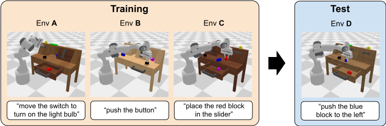
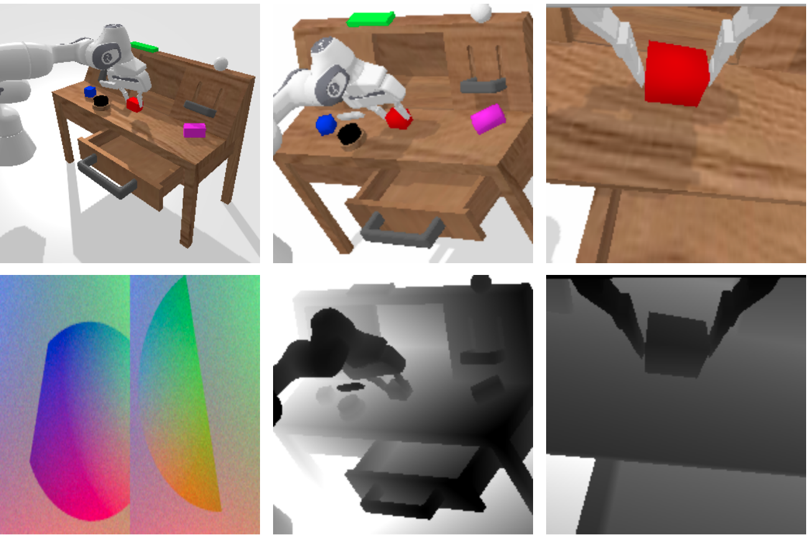

# CALVIN
[](https://github.com/psf/black)
[](https://lgtm.com/projects/g/mees/calvin/context:python)
[](https://lgtm.com/projects/g/mees/calvin/alerts/)
[](https://opensource.org/licenses/MIT)

[<b>CALVIN - A benchmark for Language-Conditioned Policy Learning for Long-Horizon Robot Manipulation Tasks</b>](https://arxiv.org/pdf/2112.03227.pdf)

[Oier Mees](https://www.oiermees.com/), [Lukas Hermann](https://lukashermann.github.io/), [Erick Rosete](https://www.erickrosete.com/), [Wolfram Burgard](http://www2.informatik.uni-freiburg.de/~burgard)

#### CALVIN won the 2022 IEEE Robotics and Automation Letters (RA-L) Best Paper Award!


 We present **CALVIN** (**C**omposing **A**ctions from **L**anguage and **Vi**sio**n**), an open-source simulated benchmark to learn long-horizon language-conditioned tasks.
Our aim is to make it possible to develop agents that can solve many robotic manipulation tasks over a long horizon, from onboard sensors, and specified only via human language. CALVIN tasks are more complex in terms of sequence length, action space, and language than existing vision-and-language task datasets and supports flexible specification of sensor
suites.



# :computer:  Quick Start
To begin, clone this repository locally
```bash
git clone --recurse-submodules https://github.com/mees/calvin.git
$ export CALVIN_ROOT=$(pwd)/calvin

```
Install requirements:
```bash
$ cd $CALVIN_ROOT
$ conda create -n calvin_venv python=3.8  # or use virtualenv
$ conda activate calvin_venv
$ sh install.sh
```
If you encounter problems installing pyhash, you might have to downgrade setuptools to a version below 58.

Download dataset (choose which split you want to download with the argument `D`, `ABC` or `ABCD`): \
If you want to get started without downloading the whole dataset, use the argument `debug` to download a small debug dataset (1.3 GB).
```bash
$ cd $CALVIN_ROOT/dataset
$ sh download_data.sh D | ABC | ABCD | debug
```
##	:weight_lifting_man: Train Baseline Agent
Train baseline models:
```bash
$ cd $CALVIN_ROOT/calvin_models/calvin_agent
$ python training.py datamodule.root_data_dir=/path/to/dataset/ datamodule/datasets=vision_lang_shm
```
The `vision_lang_shm` option loads the CALVIN dataset into shared memory at the beginning of the training,
speeding up the data loading during training.
The preparation of the shared memory cache will take some time
(approx. 20 min at our SLURM cluster). \
If you want to use the original data loader (e.g. for debugging) just override the command with `datamodule/datasets=vision_lang`. \
For an additional speed up, you can disable the evaluation callbacks during training by adding `~callbacks/rollout` and `~callbacks/rollout_lh`

You want to scale your training to a multi-gpu setup? Just specify the [number of GPUs](https://pytorch-lightning.readthedocs.io/en/latest/advanced/multi_gpu.html#select-gpu-devices) and DDP will automatically be used
 for training thanks to [Pytorch Lightning](https://www.pytorchlightning.ai/).
To train on all available GPUs:
```bash
$ python training.py trainer.gpus=-1
```
If you have access to a Slurm cluster, follow this [guide](https://github.com/mees/calvin/blob/main/slurm_scripts/README.md).

You can use [Hydra's](https://hydra.cc/) flexible overriding system for changing hyperparameters.
For example, to train a model with  rgb images from both static camera and the gripper camera with relative actions:
```bash
$ python training.py datamodule/observation_space=lang_rgb_static_gripper_rel_act model/perceptual_encoder=gripper_cam
```
To train a model with RGB-D from both cameras:
```bash
$ python training.py datamodule/observation_space=lang_rgbd_both model/perceptual_encoder=RGBD_both
```
To train a model with rgb images from the static camera and visual tactile observations with absolute actions:
```bash
$ python training.py datamodule/observation_space=lang_rgb_static_tactile_abs_act model/perceptual_encoder=static_RGB_tactile
```

To see all available hyperparameters:
```console
$ python training.py --help
```
To resume a training, just override the hydra working directory :
```console
$ python training.py hydra.run.dir=runs/my_dir
```

## :framed_picture: Sensory Observations
 CALVIN  supports a range of sensors commonly utilized for visuomotor  control:
1. **Static camera RGB images** - with shape `200x200x3`.
2. **Static camera Depth maps** - with shape `200x200`.
3. **Gripper camera RGB images** - with shape `84x84x3`.
4. **Gripper camera Depth maps** - with shape `84x84`.
5. **Tactile image** - with shape `120x160x6`.
6. **Proprioceptive state** - EE position (3), EE orientation in euler angles (3), gripper width (1), joint positions (7), gripper action (1).

<p align="center">

</p>

## :joystick: Action Space
In CALVIN, the  agent  must perform  closed-loop  continuous  control  to  follow  unconstrained  language  instructions  characterizing  complex  robot manipulation tasks, sending continuous actions to the robot at  30hz.
In  order  to  give  researchers  and  practitioners  the freedom to experiment with different action spaces, CALVIN supports  the following actions spaces:
1. **Absolute cartesian pose**  - EE position (3), EE orientation in euler angles (3),  gripper action (1).
2. **Relative cartesian displacement**  - EE position (3), EE orientation in euler angles (3),  gripper action (1).
3. **Joint action** -  Joint positions (7),  gripper action (1).

For more information, please refer to this more detailed [README](https://github.com/mees/calvin/blob/main/dataset/README.md).

## :muscle: Evaluation: The Calvin Challenge
### Long-horizon Multi-task Language Control (LH-MTLC)
The  aim  of  the  CALVIN  benchmark  is  to  evaluate  the learning  of  long-horizon  language-conditioned  continuous control  policies.  In  this  setting,  a  single  agent  must  solve complex  manipulation  tasks  by  understanding  a  series  of unconstrained  language  expressions  in  a  row,  e.g.,  “open the  drawer. . . pick  up  the  blue  block. . . now  push  the  block into the drawer. . . now open the sliding door”.
We provide  an  evaluation  protocol  with  evaluation  modes  of varying  difficulty  by  choosing  different  combinations  of sensor  suites  and  amounts  of  training  environments.
To avoid a biased initial position, the robot is reset to a neutral position before every multi-step sequence.

To evaluate a trained calvin baseline agent, run the following command:

```
$ cd $CALVIN_ROOT/calvin_models/calvin_agent
$ python evaluation/evaluate_policy.py --dataset_path <PATH/TO/DATASET> --train_folder <PATH/TO/TRAINING/FOLDER>
```
Optional arguments:

- `--checkpoint <PATH/TO/CHECKPOINT>`: by default, the evaluation loads the last checkpoint in the training log directory.
You can instead specify the path to another checkpoint by adding this to the evaluation command.
- `--debug`: print debug information and visualize environment.

If you want to evaluate your own model architecture on the CALVIN challenge, you can implement the `CustomModel` class in `evaluate_policy.py`
as an interface to your agent. You need to implement the following methods:

- \_\_init__():
  gets called once at the beginning of the evaluation.
- reset(): gets called at the beginning of each evaluation sequence.
- step(obs, goal): gets called every step and returns the predicted action.

Then evaluate the model by running:
```
$ python evaluation/evaluate_policy.py --dataset_path <PATH/TO/DATASET> --custom_model
```

You are also free to use your own language model instead of using the precomputed language embeddings provided by CALVIN.
For this, implement `CustomLangEmbeddings` in `evaluate_policy.py` and add `--custom_lang_embeddings` to the evaluation command.

### Multi-task Language Control (MTLC)
Alternatively, you can evaluate the policy on single tasks and without resetting the robot to a neutral position.
Note that this evaluation is currently only available for our baseline agent.
```
$ python evaluation/evaluate_policy_singlestep.py --dataset_path <PATH/TO/DATASET> --train_folder <PATH/TO/TRAINING/FOLDER> [--checkpoint <PATH/TO/CHECKPOINT>] [--debug]
```

### Pre-trained Model
Download the [MCIL](http://calvin.cs.uni-freiburg.de/model_weights/D_D_static_rgb_baseline.zip) model checkpoint trained on the static camera rgb images on environment D.
```
$ wget http://calvin.cs.uni-freiburg.de/model_weights/D_D_static_rgb_baseline.zip
$ unzip D_D_static_rgb_baseline.zip
```
## :speech_balloon: Relabeling Raw Language Annotations
You want to try learning language conditioned policies in CALVIN with a new awesome language model?

We provide an [example script](https://github.com/mees/calvin/blob/main/calvin_models/calvin_agent/utils/relabel_with_new_lang_model.py) to relabel the annotations with different language model provided in [SBert](https://www.sbert.net/docs/pretrained_models.html), such as the larger MPNet (paraphrase-mpnet-base-v2) or its corresponding multilingual model (paraphrase-multilingual-mpnet-base-v2).
The supported options are "mini", "mpnet" and "multi". If you want to try different SBert models, just change the model name [here](https://github.com/mees/calvin/blob/main/calvin_models/calvin_agent/models/encoders/language_network.py#L18).
```
cd $CALVIN_ROOT/calvin_models/calvin_agent
python utils/relabel_with_new_lang_model.py +path=$CALVIN_ROOT/dataset/task_D_D/ +name_folder=new_lang_model_folder model.nlp_model=mpnet
```
If you additionally want to sample different language annotations for each sequence (from the same task annotations) in the training split run the same command with the parameter `reannotate=true`.

## :chart_with_upwards_trend: SOTA Models
Open-source models that outperform the MCIL baselines from CALVIN:
<br>
<b> Grounding Language with Visual Affordances over Unstructured Data</b>
<br>
Oier Mees, Jessica Borja-Diaz, Wolfram Burgard
<br>
<a href="https://arxiv.org/pdf/2210.01911.pdf"> Paper</a>, <a href="https://github.com/mees/hulc2"> Code </a>

<b> Language Control Diffusion: Efficiently Scaling through Space, Time, and Tasks</b>
<br>
Eddie Zhang, Yujie Lu, William Wang, Amy Zhang
<br>
<a href="https://arxiv.org/pdf/2210.15629.pdf"> Paper</a>, <a href="https://github.com/ezhang7423/language-control-diffusion"> Code </a>

<b> What Matters in Language Conditioned Robotic Imitation Learning over Unstructured Data</b>
<br>
Oier Mees, Lukas Hermann, Wolfram Burgard
<br>
<a href="https://arxiv.org/pdf/2204.06252.pdf"> Paper</a>, <a href="https://github.com/lukashermann/hulc"> Code </a>

Contact [Oier](https://www.oiermees.com/) to add your model here.

## Reinforcement Learning with CALVIN
Are you interested in trying  reinforcement learning agents for the different manipulation tasks in the CALVIN environment?
We provide a [google colab](https://github.com/mees/calvin/blob/main/RL_with_CALVIN.ipynb) to showcase how to leverage the CALVIN task indicators to learn RL agents with a sparse reward.

## FAQ

#### Why do you use EGL rendering?
We use EGL to move the bullet rendering from cpu (which is the default) to gpu, which is much faster.
This way, we can also do rollouts during the training of the agent to track its performance.
By changing from cpu to gpu, the rendered textures change slightly, so be aware of this if you plan on testing pretrained models.
#### I am training with multiple GPUs and why am I get OOM errors during rollouts?
PyBullet only recently added an option to select which GPU to use for rendering when using EGL (fix was commited in 3c4cb80
on Oct 22, 2021, see [here](https://github.com/bulletphysics/bullet3/blob/master/examples/OpenGLWindow/EGLOpenGLWindow.cpp#L134).
If you have an old version of PyBullet, there is no way to choose the GPU, which can lead to problems on cluster nodes with multiple GPUs, because all instances would be placed on the same GPU, slowing down the rendering and potentially leading to OOM erros.

The fix introduced an environment variable EGL_VISIBLE_DEVICES (similar to CUDA_VISIBLE_DEVICES) which lets you specify the GPU device to render on.
However, there is one catch: On some machines, the device ids of CUDA and EGL do not match (e.g. CUDA device 0 could be EGL device 3).
We automatically handle this in our wrapper in calvin_env and find the corresponding egl device id, so you don't have to set EGL_VISIBLE_DEVICES yourself, see [here](https://github.com/mees/calvin_env/blob/main/calvin_env/envs/play_lmp_wrapper.py#L31).

#### I am not interested in the manipulation tasks recorded, can I record different demonstration with teleop?
Yes, although it is not documented right now, all the code to record data with a VR headset is present in
calvin_env in [https://github.com/mees/calvin_env/blob/main/calvin_env/vrdatacollector.py](https://github.com/mees/calvin_env/blob/main/calvin_env/vrdatacollector.py)


## Changelog
### 24 Feb 2023
- Wrong `scene_info.npy` in D dataset. Note that we have updated the corresponding checksum. Please replace as follows:
```
cd task_D_D
wget http://calvin.cs.uni-freiburg.de/scene_info_fix/task_D_D_scene_info.zip
unzip task_D_D_scene_info.zip && rm task_D_D_scene_info.zip
```

### 16 Sep 2022
- **MAJOR BUG IN ABC and ABCD dataset:** If you downloaded these datasets before this date you have to do these fixes:
   - Wrong language annotations in ABC and ABCD dataset. You can download the corrected language embeddings [here](https://github.com/mees/calvin/blob/main/dataset/README.md#language-embeddings).
   - Bug in `calvin_env` that only affects the generation of language embeddings.
   - Wrong `scene_info.npy` in ABC and ABCD dataset. Please replace as follows:
```
cd task_ABCD_D
wget http://calvin.cs.uni-freiburg.de/scene_info_fix/task_ABCD_D_scene_info.zip
unzip task_ABCD_D_scene_info.zip && rm task_ABCD_D_scene_info.zip
```
```
cd task_ABC_D
wget http://calvin.cs.uni-freiburg.de/scene_info_fix/task_ABC_D_scene_info.zip
unzip task_ABC_D_scene_info.zip && rm task_ABC_D_scene_info.zip
```
- Added additional language embeddings to dataset.


### 15 May 2022
- Added shared memory dataset loader for faster training. Refactored data loading classes.

### 7 Feb 2022
- Minor changes to the distribution of tasks in the long-horizon multi-step sequences.
- Changes to the task success criteria of pushing and lifting.
- Set `use_nullspace: true` for robot in hydra cfg of dataset. If you downloaded one of the datasets prior to this date,
edit this line in <PATH_TO_DATASET>/training/.hydra/merged_config.yaml and <PATH_TO_DATASET>/validation/.hydra/merged_config.yaml.
- Renaming `model.decoder` to `model.action_decoder`.

### 10 Jan 2022
- Breaking change to evaluation, using different intitial states for environment.

## Citation

If you find the dataset or code useful, please cite:

```bibtex
@article{mees2022calvin,
author = {Oier Mees and Lukas Hermann and Erick Rosete-Beas and Wolfram Burgard},
title = {CALVIN: A Benchmark for Language-Conditioned Policy Learning for Long-Horizon Robot Manipulation Tasks},
journal={IEEE Robotics and Automation Letters (RA-L)},
volume={7},
number={3},
pages={7327-7334},
year={2022}
}
```

## License

MIT License
